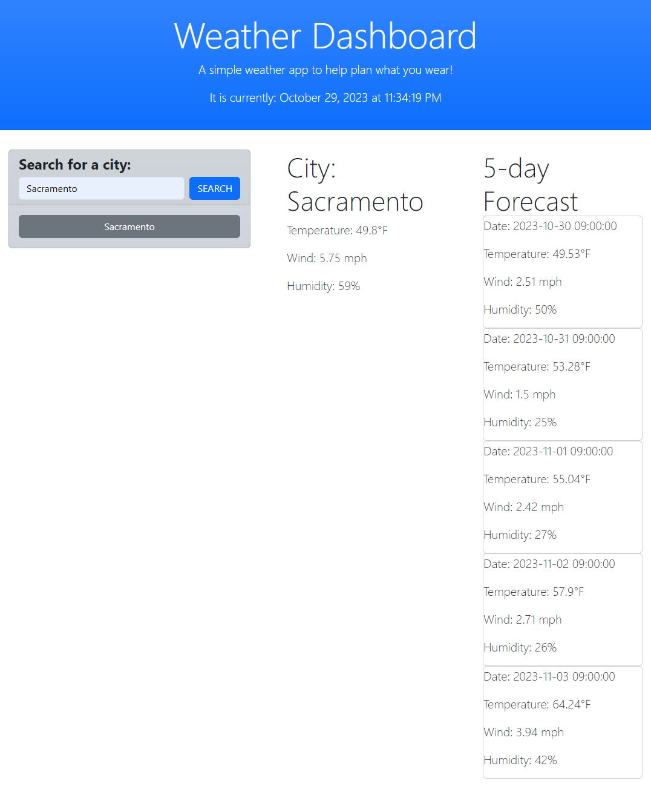

# Weather Dashboard

## Project Description

The Module 6 Challenge objective was to build a weather dashboard that will run in the browser and feature dynamically updated HTML and CSS. Third-party APIs allow developers to access their data and functionality by making requests with specific parameters to a URL. Developers are often tasked with retrieving data from another application's API and using it in the context of their own.

## Deployment Screenshot

[Deployment Link](https://travisfowlston.github.io/Weather-Dashboard/)

## Comments

- Presents the current and future conditions for the city that is searched.
- Presents city name, the date, the temperature, the humidity, and the wind speed.
- When the city is searched, it is added to the search history.
- Displays a 5-day forecast with all the same conditions.

## Credits

- Project was completed by Travis Fowlston.

## License

- N/A
